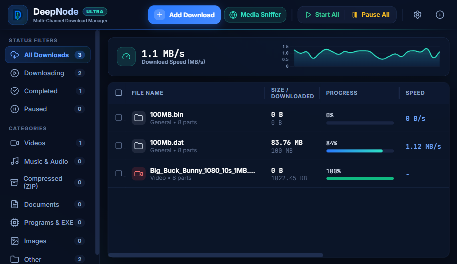

<div align="center">
  
  <h1>DeepNode Download Manager</h1>
  <p><strong>Fast, smart and organized download manager for Windows — a free, open-source IDM alternative.</strong></p>
  <p><a href="README.md"><strong>English</strong></a> · <a href="README.tr.md">Türkçe</a></p>
  <p>
    <a href="https://github.com/deepnodestudios/deepnode-download-manager/releases/latest"></a>
    
    <a href="https://deepnodestudios.net/DDM/"></a>
    
  </p>
</div>

---

<p align="center">
  
</p>

## Features

- **Multi-segment download engine** — files are split into up to 8/16 parts and fetched over parallel connections to max out your bandwidth.
- **Pause / resume / restart** — interrupted downloads continue without data loss.
- **Video capture** — download video and audio from YouTube, Vimeo, TikTok, Twitch and more, powered by `yt-dlp` (with optional `ffmpeg` merging for the highest quality).
- **Browser integration** — Manifest V3 extension for Chrome / Edge / Brave / Firefox with a floating download button on media, right-click "Download with DeepNode", and a page media grabber. See [`browser-extension/`](browser-extension/README.md).
- **Queue & scheduler** — concurrent download limits, batch lists and scheduled downloads for off-peak hours.
- **Smart categories** — downloads are auto-sorted into Video, Music, Documents, Programs, Archives and Images folders.
- **Real-time statistics** — live speed graph and per-chunk progress indicators.
- **Dark / light theme** — modern UI that follows your system preference.
- **Built-in update checker** — always know when a new release is out.
- **Private by design** — no ads, no telemetry; everything is stored locally.

## Download

Grab the latest NSIS installer from [**GitHub Releases**](https://github.com/deepnodestudios/deepnode-download-manager/releases/latest) or from the product page: **[deepnodestudios.net/DDM](https://deepnodestudios.net/DDM/)**

- Windows 10/11 (64-bit) · ~118 MB installer
- On first video download, the app automatically fetches `yt-dlp`. Installing `ffmpeg` (available in `PATH`) is recommended for best-quality audio+video merging.

## Tech Stack

| Layer | Technology |
| --- | --- |
| Desktop shell | Electron |
| UI | React 18, Vite, Chart.js (live speed graph) |
| Local server | Node.js, Express, WebSocket (`localhost:5000`) |
| Video engine | yt-dlp (+ optional ffmpeg) |
| Packaging | electron-builder (NSIS) |

## Build from Source

Prerequisites: **Node.js 18+** (and **ffmpeg** in `PATH`, optional, for best video quality).

```bash
# 0. Download helper binaries (yt-dlp.exe, ffmpeg.exe) into bin/ — see bin/README.md

# 1. Install dependencies
npm install
cd frontend && npm install && cd ..

# 2. Run in development
npm start

# 3. Build the frontend + produce the Windows installer (dist_exe/)
npm run build:exe
```

## Project Structure

```
├── electron/           # Electron main process (window, tray, IPC)
├── backend/            # Express + WebSocket server: download engine, queue, scheduler, video
├── frontend/           # React UI (src → dist)
├── browser-extension/  # Manifest V3 browser extension (Chrome/Edge/Brave/Firefox)
└── bin/                # Helper binaries (yt-dlp, ffmpeg — downloaded separately, see bin/README.md)
```

## License

This project is licensed under the [MIT License](LICENSE).
Bundled helper tools (yt-dlp, ffmpeg) are separate programs with their own licenses — see [bin/README.md](bin/README.md).

## Links

- Website: [deepnodestudios.net/DDM](https://deepnodestudios.net/DDM/)
- Releases: [github.com/deepnodestudios/deepnode-download-manager/releases](https://github.com/deepnodestudios/deepnode-download-manager/releases)
- Contact: [deepnodestudios@gmail.com](mailto:deepnodestudios@gmail.com)

---

<div align="center">Developed by <a href="https://deepnodestudios.net">DeepNode Studios</a></div>
